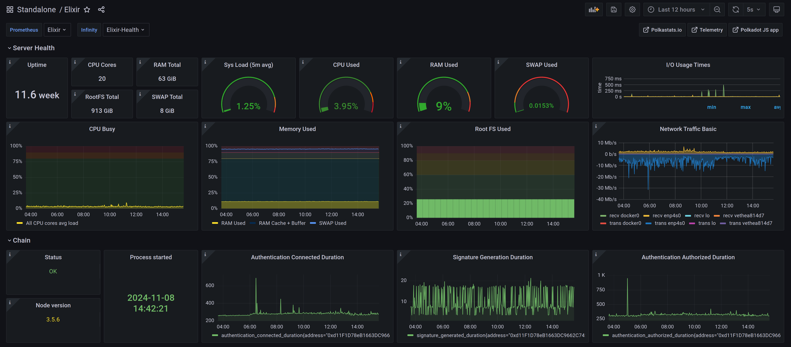

# Elixir monitoring

Community made dashboard for the Elixir node



## Install guide

1. Install Prometheus on the system with Elixir node https://prometheus.io/docs/prometheus/latest/installation/
2. Install Node Exporter on the same machine https://prometheus.io/docs/guides/node-exporter/
3. Edit Prometheus configuration file:

```
global:
  scrape_interval: 15s
  evaluation_interval: 15s

scrape_configs:
  - job_name: "prometheus"
    scrape_interval: 5s
    static_configs:
      - targets: ["localhost:9090"]
  - job_name: "elixir_node"
    scrape_interval: 5s
    static_configs:
      - targets: ["localhost:17690"]
  - job_name: "elixir_health"
    scrape_interval: 5s
    metrics_path: /health
    static_configs:
      - targets: ["localhost:17690"]
  - job_name: "node_exporter"
    scrape_interval: 5s
    static_configs:
      - targets: ["localhost:9100"]
```

4. Install Infinity plugin for your Grafana instance
   
 `grafana-cli plugins install yesoreyeram-infinity-datasource`

5. Add your Prometheus and Infinity data sources to grafana </BR>
    Prometheus URL - `http://<your-node-ip>:9090` </BR>
    Infinity URL - `http://<your-node-ip>:17690/health`
6. In the Dashboards Grafana menu import `elixir_template.json` from this repository
7. In the dashboard top left corner fill the "Prometheus" and "Infinity" variables with your datasources
8. Secure the access to the endpoints with UFW 
```
sudo ufw allow from your-grafana-ip proto tcp to any port 9090
sudo ufw allow from your-grafana-ip proto tcp to any port 17690
```
